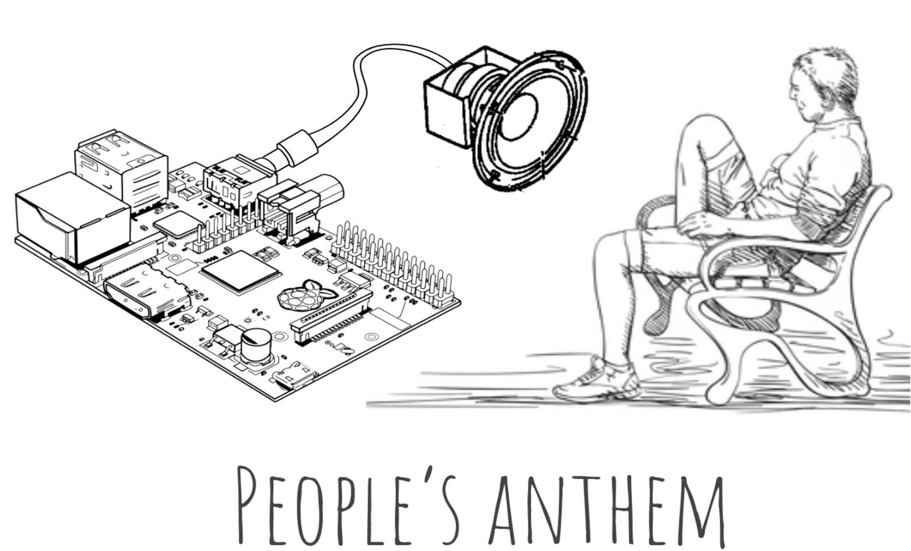

# People's Anthem



A project using face recognition and a raspberry pi's webcam to identify a person and play their favorite music

People's anthem allows its user to play sounds or music from a Raspberry pi when a person walks in front of a webcam attached to the raspberri pi.

## Requirements
You will need:
* A [raspberri pi](https://www.raspberrypi.org/) (rpi)
* Docker installed on your OS ([how to install](https://docs.docker.com/engine/install/debian/))
* A [raspberri pi webcam](https://www.raspberrypi.org/products/camera-module-v2/)
* A speaker plugged-in to the rpi via the audio jack
* A source of music (mp3 or a Spotify account) (More info [here](doc/setting-up-spotify.md))


## Install
To get start, you will need `docker` and an internet connection.
The installation might take up to 150 minutes on a rpi4.

```bash
git clone git@github.com:alexantoinefortin/peoples-anthem.git
cd peoples-anthem
make build-peoples-anthem
```


## Usage
In this section, we discuss how to:
1. Build a face dataset
2. Train a face recognition algorithm
3. Use that model to recognize people and to play their Spotify playlist when they are recognized

### 1. Building a face dataset

#### 1.1 Choosing a location for your rpi
The first step is to place your rpi and rpi-camera at a place where you can collect images of the people you would like for the algorithm to be able to recognize.

#### 1.2 Run the face picture recording code
```bash
make run-record-faces
```
The images will be saved, in this repo, in a new directory: `./data`.

To kill the container use: `docker kill peoples_anthem`.

Let the container run for as long as necesseray to collect images in different lighting conditions, etc. 

#### 1.3 Create a train/test set
Reorganize the images saved in `./data` (see step 1.2) according to the following directory structure. 

The category _misc_ should be added and should includes unrecognizable faces, faces of people you do not want to recognize or pictures of non-face items. This will help the algorithm in identifying out-of-scope faces.

```
./data/
├── train/
│   ├── alice/
│   ├── bob/
│   ├── misc/
├── test/
    ├── alice/
    ├── bob/
    ├── misc/
```

### 2. Train a face recognition algorithm
Once step 1. is completed, run the model training code:

```bash
make train-model
```
By default, your trained model will be saved in `./models/model.v1.pklz`. 

The code will print the train/test accuracy.

As an example, during the development of this project, I trained the model to recognize 4 different persons + 1 _misc_ category and obtained an `accuracy_train=0.85` and an `accuracy_test=0.83`.

Try adjusting the model's hyper-parameters in `code/train_face_recognition.py`

### 3. Play people's spotify playlist when recognizing them
Once step 2. is completed, you need to setup a config file so that the code can play the spotify playlist of your choice when it recognizes someone.

For guidance on how to do so, please see: [setting-up-spotify](doc/setting-up-spotify.md)

Once this is done, make sure that a speaker is plugged in the rpi's audio jack and run the code:
```bash
make run-peoples-anthem
```
To kill the container use: `docker kill peoples_anthem`.

## License

[GPLv3](LICENSE)