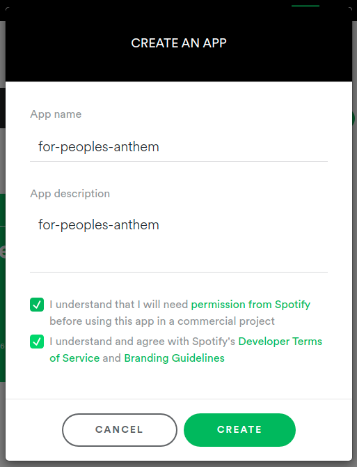
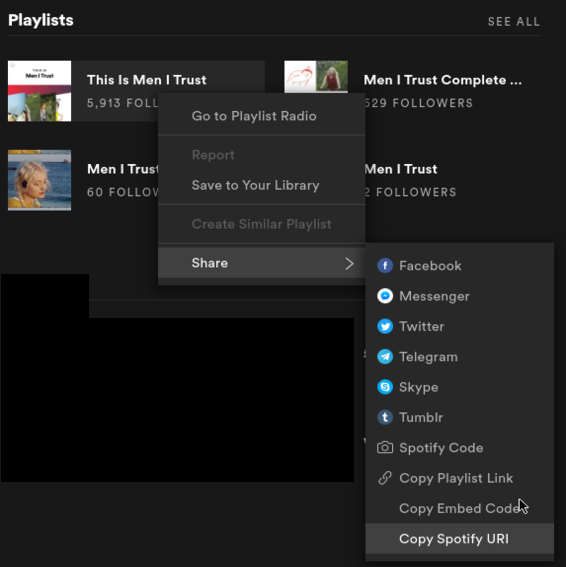

# Setting up Spotify with people's anthem
In this documentation, we review how to get the appropriate Spotify credentials so that you can play music from your playlist with `People's anthem`.

We will cover:
1. What files to edit
2. How to get your Spotify `client_id`
3. How to get your Spotify `client_secret`
4. How to get your Spotify playlist URI

## 1. What files to edit
Start by opening the file `peoples-anthem/conf/config.yml`.

This file is used in `peoples-anthem/code/peoples_anthem.py` and its information is passed to the Spotify API's via the [Spotipy](https://spotipy.readthedocs.io/en/2.16.1/) python package.

## 2. How to get your Spotify `client_id`
In this section, we are going to get the `client_id` for each person that we will be recognizing.

In the example below, `peoples-anthem/conf/config.yml` is configured to work for 2 people: `alice` and `bob`.

Note: The name used here (`alice` and `bob`) must match the name of the directories in `peoples-anthem/data/train/`.

We will see how to update this section of the config file:
```yaml
SECRET:
    alice: 
      client_id: alice-spotify-client-id
      client_secret: alice-spotify-client-secret
    bob: 
      client_id: bob-spotify-client-id
      client_secret: bob-spotify-client-secret
```

### 2.1 Go to https://www.spotify.com/, scroll down and click on "Developers" to get to the Developers menu


### 2.2 From there, click on _Dashboard_ and log in with your usual Spotify username and password


### 2.3 Choose to create a new App




### 2.4 In `peoples-anthem/conf/config.yml`, replace `alice-spotify-client-id` by your `Client ID`


Note: If desired, `alice` and `bob` can share the same `client_id`.

## 3. How to get your Spotify `client_secret`

### 3.1 From step 2.4, click on `SHOW CLIENT SECRET` and replace `alice-spotify-client-secret`, in `config.yml`, by  your `Client Secret`


Note: If desired, `alice` and `bob` can share the same `client_secret`.

Congrats! At this point you are set-up to play Spotify from `people's anthem`!

## 4. How to get your Spotify playlist URI
Before you can start using `people's anthem`, there is one last thing to do.
We need to tell `people's anthem` what playlist to play for each person.

For this, we need to modify this section of `peoples-anthem/conf/config.yml`:

```yaml
PLAYLIST:
  alice: spotify:playlist:alice
  bob: spotify:playlist:bob
```

### 4.1 Go to the Spotify app and find a good playlist


### 4.2 Right click and select "Copy Spotify URI"



In this example, the Spotify playlist is this one: `spotify:playlist:37i9dQZF1DZ06evO24IA7u`

### 4.3 In `peoples-anthem/conf/config.yml`, replace `spotify:playlist:alice` by the `Spotify URI`

```yaml
PLAYLIST:
  alice: spotify:playlist:37i9dQZF1DZ06evO24IA7u
  bob: spotify:playlist:34ymV2IwnxzWjILCycL0Ki
```

Note: `People's anthem` is set up to play Spotify playlists. This is in contrast with Spotify artist radio, etc. Make sure that your `Spotify URI` starts with: `spotify:playlist:`.
